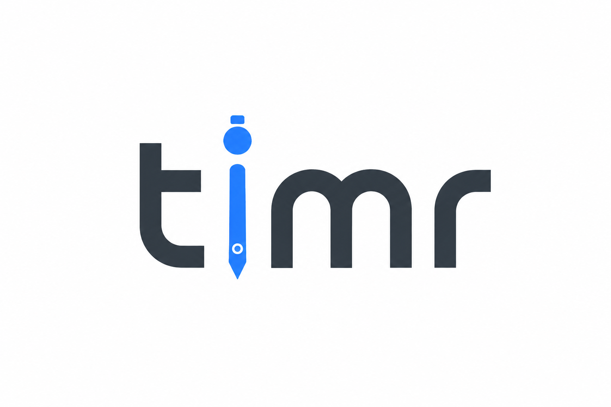
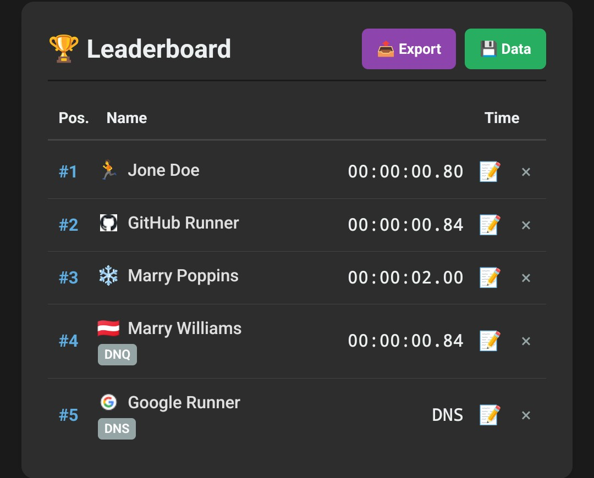
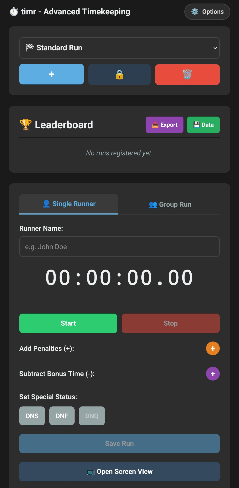

# ⏱️ timr - Timing & Leaderboard System



HTML based Timing App for Sports and Other Activities. Coded heavily with AI and some (very few lines) of own Code.

A high-performance, lightweight web application for precise timing, specially developed for sports events, scout gatherings, and other competitions.

A hosted version can be found here: https://timr.mrwoelfel.eu/

## 🏕️ How it all begun
I am a scout leader from Vienna/Austria and for this years summer camp I planed an obstacle course for our kids to compete in. Our scout camp is located in the middle of nowhere in the woods. So no power, no water but phone reception. During the obstacle course the kids had to complete some challenges which earned them either bonus seconds or penalties. 

The night before I sat at a table with the other leaders and asked if anyone knew of an stopwatch app that allows you to add penalties easily.  No one knew such an app and I couldn't find one online either. (After just like 2 minutes of searching) And because I have an IT Background and obviously couldn't start coding in the middle of nowhere without a Notebook I quickly promoted Google Gemini (the only AI App on my Phone) to make such an App in one HTML page. I quickly hosted it on my Webserver and what can I say: It worked like a charm and I used it for the course.

At night after the event I had some more ideas und kept promoting for fun and that's how that project started.

Well and the result of this madness is....this repo. 

**THE REST OF THIS FILE IS AI GENERATED**


## 🚀 Features

* **Precision Timing:** Start, stop, and pause functionality for individual runners.
* **Group Mode:** Manage and time multiple runners simultaneously.
* **Dynamic Adjustments:** Easily add penalty seconds or subtract bonus time with configurable buttons.
* **Leaderboard:** Automatic result sorting with export options (PDF, Image, JSON).
* **Dynamic Localization:** Fully modular language system managed via the `lang/` directory and `lang.info`.
* **Screen View:** Separate popup window for live projection on large displays.
* **Dark Mode:** Eye-friendly design for night-time or low-light operation.

## 🛠️ Technical Details

* **Language Management:** Languages are dynamically loaded at startup based on the `lang.info` configuration file.
* **Data Storage:** Uses browser `localStorage` for persistent data. Supports full import/export functionality via JSON or compressed URL parameters.
* **Zero Dependencies:** Runs directly in the browser; requires a web server to handle `fetch()` requests for language and configuration files correctly.

## 📦 Installation & Setup

1. Clone this repository or download the source code.
2. Ensure all files (`index.html`, `style.css`, `lang.info`, `ver.info`, `whitelabel.info`) and the `lang/` directory are present in the root folder.
3. **Important:** Due to browser security policies regarding `fetch()`, please run the application through a local web server (e.g., VS Code "Live Server", `python -m http.server`, or similar). Opening the `index.html` directly via `file://` will prevent the language files from loading.

## 🌍 Adding a New Language

1. Create a new file in the `lang/` folder, e.g., `fr.lang`.
2. Add the language code (e.g., `fr`) to the `available` array in your `lang.info` file.
3. Follow the structure of the `de.lang` or `en.lang` files to define your translations.

## 🎨 Whitelabeling & Customization

The system is designed for flexibility and can be tailored to match specific event identities. You can configure core visual and functional aspects through the `whitelabel.info` file:

* **Custom Title:** Set a unique application name via the `Title` parameter.
* **Branding URL:** Define a primary website URL that users will be redirected to when clicking the header title.
* **Support Integration:** Easily toggle and configure external links for "Buy me a Coffee" and "GitHub" integration by defining their respective URLs. 

*Configuration example in `whitelabel.info`:*

```text
Title=Name for the App
URL=https://your-website.com/timr
coffee=Link to Donate to the project
github=https://github.com/your-repository
```

## 🏃 Naming Runners
(This Chapter is not AI generated)

* Runners in the Leaderboard default to the 🏃 Symbol.
  * By Adding [] as a prefix the symbol can be customized
     * By putting an emoji in the middle this will be the symbol
     * By puttin a country code in the middle this will be the symbol
     * By putting a Domain in the middle, the favicon will be the symbol

```text
Name = 🏃 Name
[❤️] Name = ❤️ Name
[DE] Name = 🇩🇪 Name
[Google.com] Name = 🌐 Name (where 🌐 is the Google Logo)
```


## ☕ Support & Contact

This project is developed with passion. (by AI) If you find it useful, I would be honored to receive your feedback or support on GitHub!

## 📷 Screenshots

